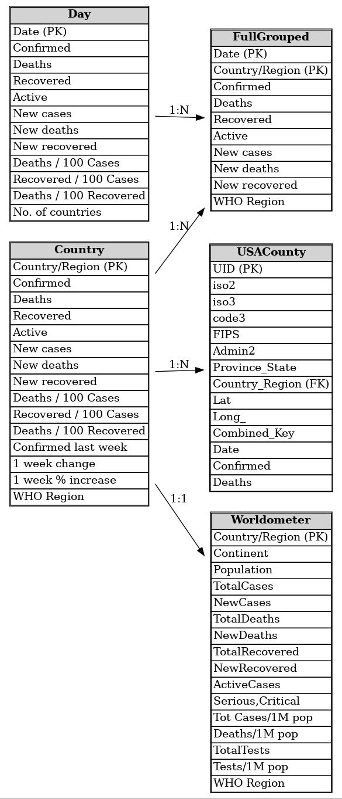

# Sr Data Engineer Challenge – COVID-19 End-to-End Data Pipeline

## Overview

This repository contains an end-to-end ingestion and processing pipeline for the **COVID-19 Kaggle dataset**  
(https://www.kaggle.com/datasets/imdevskp/corona-virus-report), implemented to match the technical challenge requirements: Spark ingestion using **RDD + parallelism**, Pandas ingestion, **Parquet** outputs, **OOP** in a notebook, **type enforcement in the last layer**, **delta/offset control** (process only novelties per run), and a **DER** diagram. :contentReference[oaicite:0]{index=0} :contentReference[oaicite:1]{index=1}

The solution is intentionally structured to look and behave like a production ingestion job: clear responsibilities, deterministic incremental processing, and explicit typing before persistence.

---

## Requirements Covered

Per the challenge document, this implementation provides:

- Download dataset from Kaggle (API token based).
- Load datasets using **Spark** and store as **Parquet** (using **RDD** + parallelism).
- Load datasets using **Pandas** and store as **Parquet**.
- Provide a **DER** diagram suggestion for data modeling.
- Code written in an **object-oriented** way (classes inside the notebook).
- Add comments in the important parts.
- Enforce correct types **in the last layer**.
- Implement **delta/offset control**: each processing run persists only novelties. :contentReference[oaicite:2]{index=2} :contentReference[oaicite:3]{index=3}

---

## High-Level Architecture

The pipeline is split into three layers:

1. **Raw Layer**  
   - Kaggle ZIP is downloaded and extracted to `raw/extracted/` as CSV files.

2. **Processing Layer (two independent pipelines)**  
   - **Spark pipeline** (RDD-based read → DataFrame → delta filter → type casting → Parquet append)  
   - **Pandas pipeline** (CSV read → delta filter → type casting → Parquet write)

3. **State Layer (delta control)**  
   - Persisted “seen keys” per dataset in Parquet under `state/` to ensure the next run processes only new rows.

---

## Output Structure

After a successful run, the project directory looks like:

```
/content/covid_challenge/
├── raw/
│ └── extracted/ # Kaggle CSVs extracted here
├── parquet_spark/
│ └── <dataset_name>/ # Spark Parquet outputs (append per run)
├── parquet_pandas/
│ └── <dataset_name>/ # Pandas Parquet outputs (one file per run)
├── state/
│ ├── <dataset>_seen_keys.parquet # Spark state (hash keys)
│ └── <dataset>_seen_keys_pandas.parquet # Pandas state (hash keys)
└── deliverable_covid_challenge.zip # Deliverable with outputs + state + README
```


The deliverable ZIP contains the required artifacts (data + process outputs). :contentReference[oaicite:4]{index=4}

---

## Key Design Decisions

### 1) Dataset Discovery via a Catalog

Instead of hardcoding the ingestion flow per file, datasets are defined through `DatasetSpec` objects produced by `DatasetCatalog`.  
Each spec describes:
- dataset name (used for output folders)
- CSV path
- composite key columns (for delta)
- expected types to enforce at the final layer

This keeps the ingestion logic generic and makes it easy to add or remove datasets without rewriting the pipeline.

### 2) Delta / Offset Control (Process Only Novelties)

A core requirement is to process only “novelties” on each run. :contentReference[oaicite:5]{index=5}

This is implemented through a deterministic composite-key hashing approach:

- For each row, the dataset’s **key columns** are concatenated in a null-safe way.
- A **SHA-256** hash is computed as `row_key_hash`.
- Previously processed hashes are stored as a Parquet “state” file.
- The new run reads state and keeps only rows whose `row_key_hash` is not present.

**Why hashing instead of storing all composite columns?**
- More compact state storage
- Simple schema (one column)
- Fast anti-join in Spark
- Low collision probability with SHA-256

**Spark implementation**
- Uses `sha2(concat_ws(...), 256)` and a `left_anti` join against state.

**Pandas implementation**
- Uses `hashlib.sha256` and filters with `isin()` against the stored hashes.

### 3) Type Handling in the Last Layer

The challenge requests explicit type handling in the last layer (e.g., numbers must be numbers, not strings). :contentReference[oaicite:6]{index=6}

This pipeline follows a strict rule:

> Raw ingestion keeps strings; type casting happens right before writing Parquet.

This mirrors real ingestion patterns: CSV data is frequently messy, so the safest approach is to enforce a clean schema at the final persistence layer.

**Spark typing**
- Uses a `SparkSchemaCaster` with an explicit type map.
- Dates: `to_date`
- Numerics: remove commas, then cast to numeric types
- Column escaping using backticks (`\`col name\``) to safely handle spaces, slashes, commas, etc.

**Pandas typing**
- Uses a `PandasSchemaCaster`
- Numerics: `to_numeric(errors="coerce")`
- Dates: `to_datetime(errors="coerce").dt.date`
- Nullable integer dtype: `Int64` to preserve nullability

---

## Spark Pipeline Details (RDD + Parallelism)

The Spark ingestion follows the requirement of using RDD. :contentReference[oaicite:7]{index=7}

### Why RDD in this solution
The challenge explicitly asks for RDD usage. In Spark, the clean way to comply without losing DataFrame benefits is:

1. Read the file as an RDD of lines:
   - `spark.sparkContext.textFile(csv_path)`
2. Parse it using Spark’s CSV reader:
   - `spark.read.option("header", True).csv(rdd)`

This still uses Spark’s distributed execution model while satisfying the “use RDD” constraint.

### Spark write strategy
- Delta rows are appended to the dataset folder:
  - `df.write.mode("append").parquet(out_path)`
- State is overwritten each run with the merged set of keys:
  - `keys_df.write.mode("overwrite").parquet(state_path)`

---

## Pandas Pipeline Details

The Pandas ingestion is intentionally independent (separate classes and state file), but semantically equivalent:

- Read CSV with `pd.read_csv`
- Compute the same concept of a composite key hash
- Filter out hashes already seen
- Enforce types at the last layer
- Write a Parquet file per run

### Why one file per run (Pandas)?
Pandas does not natively “append” to Parquet folders in the same way as Spark. Writing one Parquet file per run keeps append semantics simple and avoids accidentally overwriting previous results.

---

## Clean Code & SOLID Principles Applied

This notebook is structured as a small system, not as a single procedural script.

### Single Responsibility Principle (SRP)
Each class owns one responsibility:
- `KaggleDownloader`: download and unzip dataset
- `DatasetCatalog`: discover CSVs and define dataset specs
- `SparkSessionFactory`: configure and create SparkSession
- `SparkSchemaCaster` / `PandasSchemaCaster`: final layer typing
- `DeltaStateStore` / `PandasDeltaStateStore`: persistence of seen keys
- `SparkCovidIngestor` / `PandasCovidIngestor`: ingestion + delta logic + write
- `PipelineRunner`: orchestration only

### Open / Closed Principle (OCP)
To support a new dataset, you typically only add a new `DatasetSpec` in the catalog. The ingestion components remain unchanged.

### Dependency Injection (pragmatic in a notebook)
The `PipelineRunner` receives collaborators (downloader, catalog, spark factory). This keeps orchestration readable and avoids a “God method” mixing all concerns.

---

## Execution

### 1) (Optional) Clean previous outputs
A small cell deletes previous output folders (`parquet_spark`, `parquet_pandas`, `state`) to allow a fresh run.

### 2) Run the pipeline
The runner executes:
- Ensure directory structure
- Download + extract Kaggle dataset
- Discover datasets
- Spark ingestion for each dataset
- Pandas ingestion for each dataset
- Print a Spark schema + sample rows for validation
- Build deliverable zip
- Print DER diagram in Mermaid
- Stop Spark session cleanly

---

## Example Output (Observed Run)

A sample run produced:

- Spark ingestion (delta = full load on first run)
  - `covid_19_clean_complete`: read 49,068 / delta 49,068
  - `country_wise_latest`: read 187 / delta 187
  - `day_wise`: read 188 / delta 188
  - `full_grouped`: read 35,156 / delta 35,156
  - `usa_county_wise`: read 627,920 / delta 627,920
  - `worldometer_data`: read 209 / delta 209

The Spark schema check confirms the final types were enforced (e.g., `Date` as `date`, metrics as `long/double`).

On subsequent runs (without changing input data), `delta_written` should drop to `0` for each dataset because all hashes already exist in the state layer.

---

## DER Diagram (Mermaid)

This section presents the Entity–Relationship diagram derived from the dataset, defining entities, attributes, primary and foreign keys, and relationships to support a clear and consistent analytical data model.



---

## Deliverable

The pipeline creates:

- `deliverable_covid_challenge.zip`

Containing:
- `parquet_spark/`
- `parquet_pandas/`
- `state/`
- `README_DELIVERABLE.txt`

This matches the expected deliverable format: process + data in a ZIP file. :contentReference[oaicite:8]{index=8}

---

## Notes for Reviewers

- The Spark pipeline intentionally reads CSV via RDD to comply with the challenge constraint.
- Delta control is deterministic and robust across runs.
- Type enforcement is explicitly applied only at the last step before persistence.
- The code is organized to be readable, testable, and extendable even within a notebook context.

---
